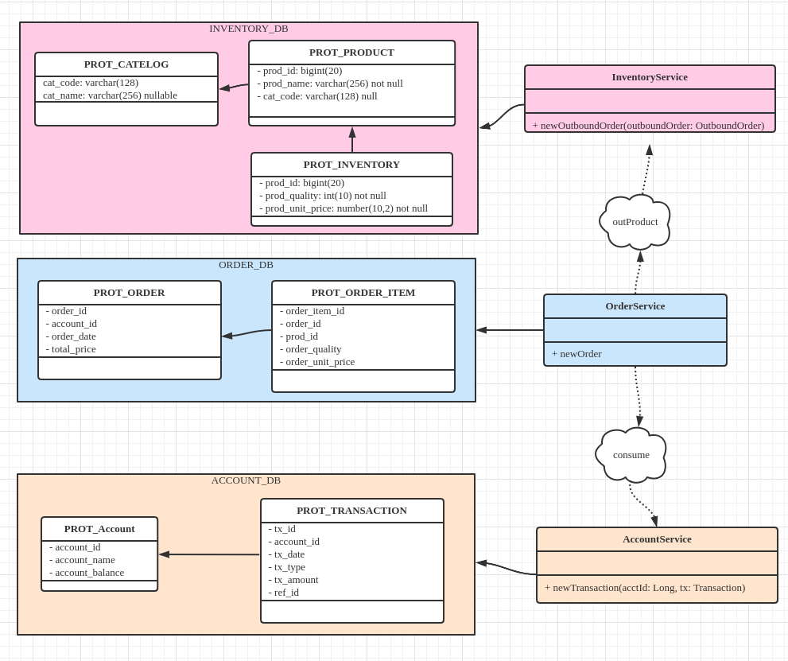
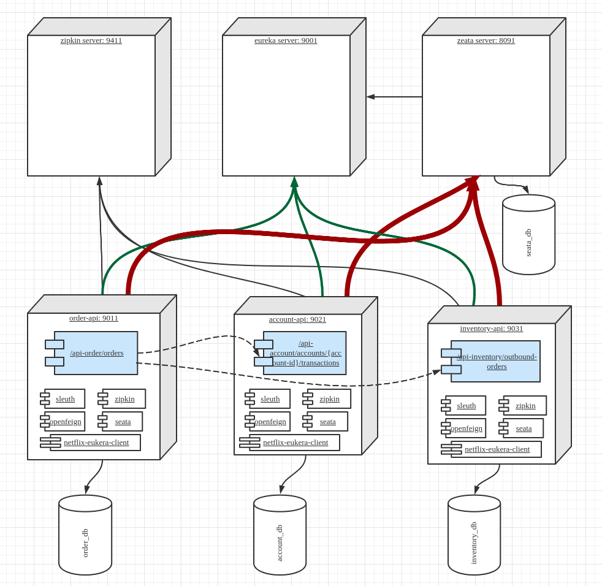
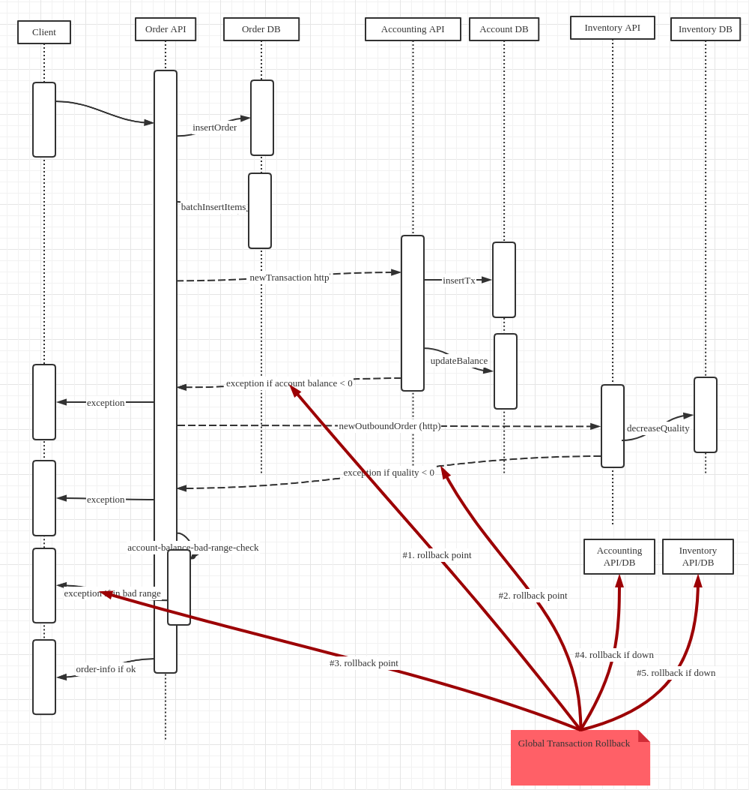

# Goal
Try to demo seata distribute transaction server, how to rollback committed microservices transactions
# Design
## Hypothetical Scenario Overview
It mimics an online shopping system, which contains:
* __order sub-system__ contains order and its detail items
* __account sub-system__ contains client's account balance
* __inventory sub-sytem__ contains product's quality and unit price
## Behavior Description
When client submits an order, it 
1. first hit order system to
    1. insert new order
    1. insert new order detail items
1. call account sub-system to
    1. record the order transaction
    1. update account balance by reducing ordered amount
    1. if updated balance < 0, it should rollback order-system insert and previous account system insert, 
    although order system is in different server/pod instances
1. call inventory system to
    1. update product quality by decreasing ordered quality for each detail items
    1. if updated quality < 0, it should rollback order-system, account-system insertion/updation although
    they are in different server/pod instances, and locally they are already committed
* the main goal is to demo seata, for inventory updation, ideally it should use <code>select for update</code> to avoid concurrency issues
## ER-Model

## Deployment Diagram

* it needs 4 database servers or 4 database instances, see seata-demo-db
* zepkin server can use docker
* seata server can use docker / or download seata-1.3.0 from web
* eureka-server is just a simple spring-boot app, see eureka-server
## Sequence Diagram

