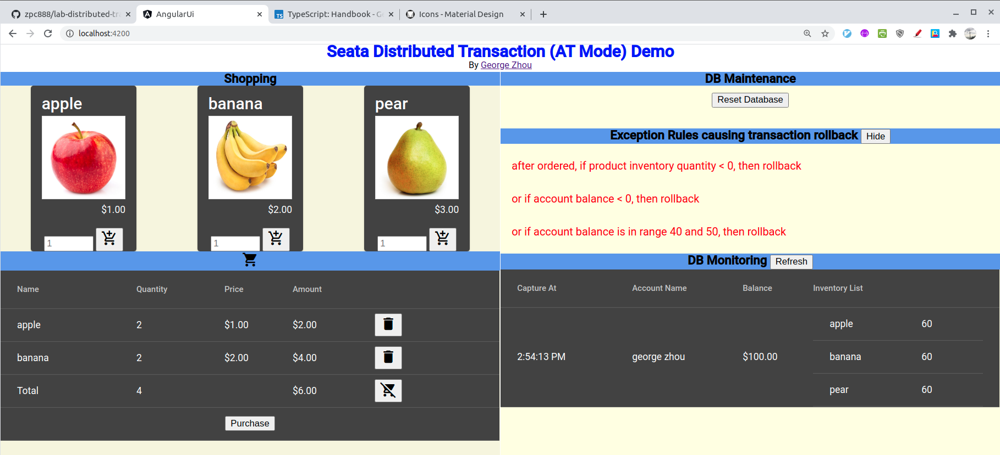
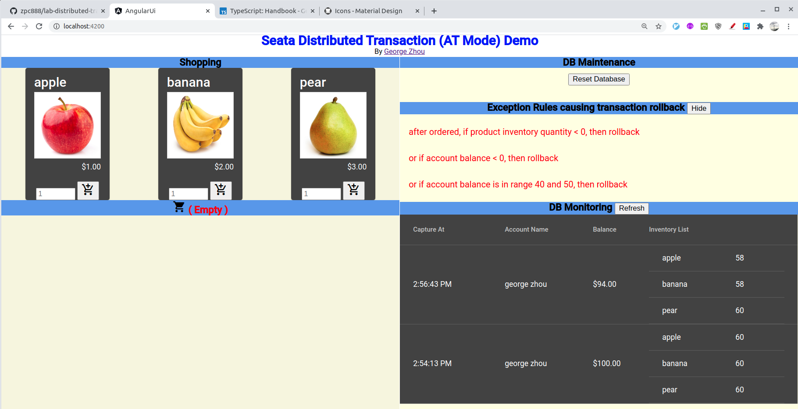
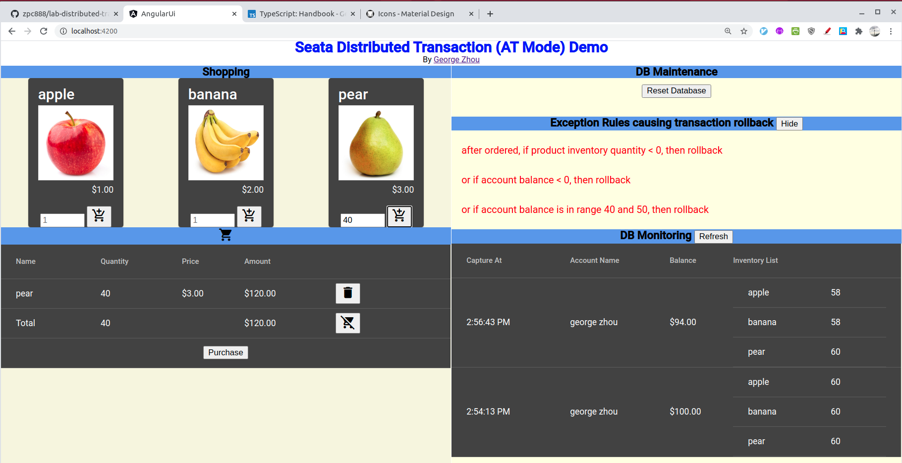
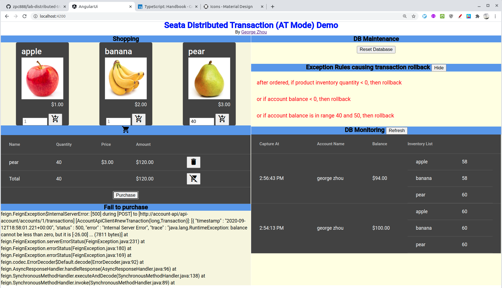

# Goal
Try to demo seata distributed transaction server, how to rollback committed microservices transactions
# Technical Stack
* Spring Boot 2.3.3
* Spring Cloud 2.2.4
* Seata 2.2.0
* Java 14 
* Kotlin 1.3
* Angular 10
* Angular Material 10
* MySQL 8
* Gradle, Docker, Zipkin, etc. 
# Screenshots from running app
## normal case - transaction committed ok
* try to order 2 apple and 2 bananas

* expecting their inventory quantity: 60 - 2 = 58, and account balance: $100 - 2*1 - 2*2 = $94

## abnormal case - transaction rollback due to NSF
* try to order 40 pears

* expecting pear quantity: 60 - 40 = 20 (ok), and balance: $94 - 3*40 = -26, error to rollback pear quantity update, order, etc, i.e. db-state should be the same as before

# Design
## Hypothetical Scenario Overview
It mimics an online shopping system, which contains:
* __order sub-system__ contains order and its detail items
* __account sub-system__ contains client's account balance
* __inventory sub-sytem__ contains product's quantity and unit price
## Behavior Description
When client submits an order, it 
1. first hit order system to
    1. insert new order
    1. insert new order detail items
1. call account sub-system to
    1. record the order transaction
    1. update account balance by reducing ordered amount
    1. if updated balance < 0, it should rollback order-system insert and previous account system insert, 
    although order system is in different server/pod instances
1. call inventory system to
    1. update product quantity by decreasing ordered quantity for each detail items
    1. if updated quantity < 0, it should rollback order-system, account-system insertion/updation although
    they are in different server/pod instances, and locally they are already committed
* the main goal is to demo seata, for inventory updation, ideally it should use <code>select for update</code> to avoid concurrency issues
## ER-Model

## Deployment Diagram

* it needs 4 database servers or 4 database instances, see seata-demo-db
* zepkin server can use docker
* seata server can use docker / or download seata-1.3.0 from web
* eureka-server is just a simple spring-boot app, see eureka-server
## Sequence Diagram

